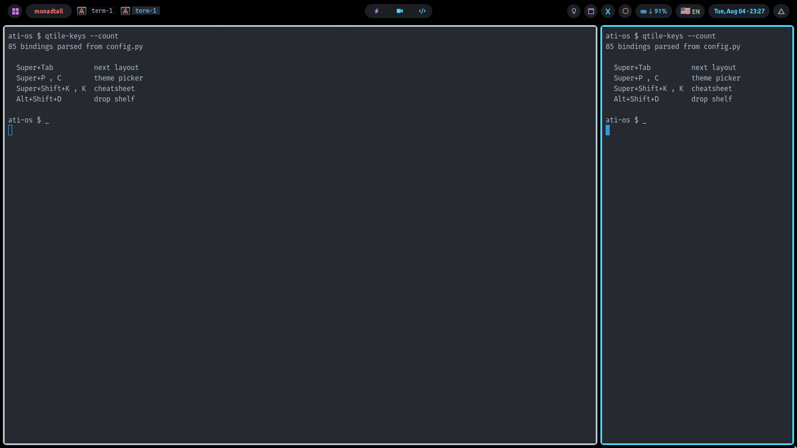
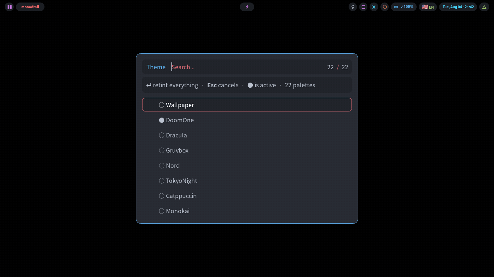
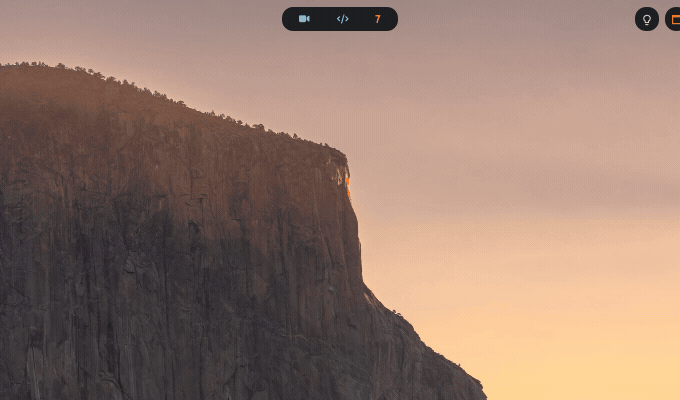
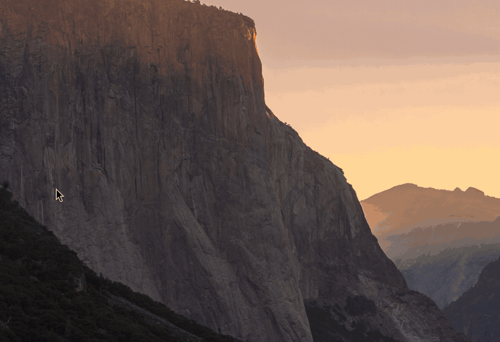
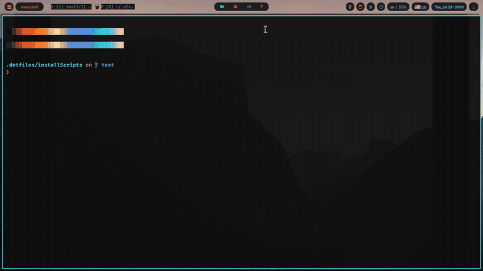

<div align="center">

<picture>
  <source media="(prefers-color-scheme: dark)" srcset="IMGS/wordmark-dark.png">
  
</picture>

**Arch Linux and a qtile desktop that is already configured.**

22 themes that retint every app at once, a drop-stash, a package picker,
and a restart that doesn't flash.

[**Manual**](https://mohamedattiadev.github.io/ATI-OS/) ·
[Install from USB](https://mohamedattiadev.github.io/ATI-OS/install-usb.html) ·
[Install onto Arch](https://mohamedattiadev.github.io/ATI-OS/install-git.html) ·
[Shortcuts](https://mohamedattiadev.github.io/ATI-OS/keybindings.html) ·
[Troubleshooting](https://mohamedattiadev.github.io/ATI-OS/troubleshooting.html)



**[▶ Watch the 1:38 tour](https://mohamedattiadev.github.io/ATI-OS/#films)** — the whole
desktop, no narration, including the parts that are not finished.

</div>

---

## Install

**Empty machine, or starting fresh?** Write the ISO to a USB stick and boot it.
About 20 minutes.

→ [**Download and write the stick**](https://mohamedattiadev.github.io/ATI-OS/install-usb.html#download)

**Already running Arch?** One command. Set aside an hour or two and 25 GB —
most of that is `pacman-static` compiling from source. It is unattended.

```sh
git clone https://github.com/Mohamedattiadev/ATI-OS.git ~/.dotfiles \
  && cd ~/.dotfiles/installScripts && ./install.sh
```

Then log in at the TTY and type `letsgo`. There is no display manager, on
purpose.

→ [What the installer does, module by module](https://mohamedattiadev.github.io/ATI-OS/install-git.html)

**Already installed?** The USB image is built now and then; the desktop is
improved every day. One command catches you up — no reinstall:

```sh
ati-update
```

Shows what changed, asks, then does only what that update needs. Your windows
survive the restart, and if the new config doesn't load it rolls itself back.

→ [`--check`, `--stash` and the rest](https://mohamedattiadev.github.io/ATI-OS/tools.html#update)

**UEFI only.** Verified on a clean Arch VM, and in QEMU across three install
modes. Not verified: AMD or NVIDIA graphics, or a HiDPI panel.

---

## What you get

|  |  |
|---|---|
| **[22 themes](https://mohamedattiadev.github.io/ATI-OS/themes.html)** | One command retints bar, terminal, rofi, GTK, Qt, browser, nvim — and your folder icons |
| **[Keyboard-driven](https://mohamedattiadev.github.io/ATI-OS/keybindings.html)** | ~90 bindings, grouped into modes that announce themselves in the bar |
| **[A bar that does things](https://mohamedattiadev.github.io/ATI-OS/widgets.html)** | Updates, audio, wifi, bluetooth, displays — popups, not terminals |
| **[~45 tools](https://mohamedattiadev.github.io/ATI-OS/tools.html)** | Drop-stash, package manager, offline PDF toolkit, cheatsheets, screenshots, dictation |
| **[Mouse-free clicking](https://mohamedattiadev.github.io/ATI-OS/keybindings.html#hintium)** | [Hintium](https://github.com/Mohamedattiadev/Hintium) labels everything clickable — hint, scroll and caret modes from the home row |
| **[Documented](https://mohamedattiadev.github.io/ATI-OS/troubleshooting.html)** | 187 troubleshooting entries, searchable, reachable from the desktop itself |

<div align="center">

| | |
|:--:|:--:|
|  |  |
| **Themes** — everything at once | **qdrop** — drag in, drag back out |
|  |  |
| **qupdate** — updates, no terminal | **Restart** — without the flash |

</div>

→ [All 22 palettes side by side](https://mohamedattiadev.github.io/ATI-OS/themes.html)

---

## The six for day one

| | |
|---|---|
| `Super`+`Enter` | Terminal |
| `Super`+`Shift`+`Enter` | Launcher |
| `Super`+`Shift`+`C` | Close window |
| `Super`+`1`…`9` | Switch workspace |
| `Super`+`Tab` | Change layout |
| `Super`+`Shift`+`K` then `K` | **Every shortcut, on screen** |

→ [The complete list](https://mohamedattiadev.github.io/ATI-OS/keybindings.html)

---

## Something broke

Ask the desktop first: **click the Arch logo** in the bar. Every section is
generated from the live system, so it cannot go stale.

→ [Troubleshooting](https://mohamedattiadev.github.io/ATI-OS/troubleshooting.html)
· [`TROUBLESHOOTING.md`](TROUBLESHOOTING.md)

---

## Repository layout

```
.config/          the dotfiles — stow links these into ~
  qtile/            window manager, bar, popups, scripts
  arch-config/      the installer's package modules (*.yaml)
  AtiScriptsV1/     rofi tools, theme switching, boot splash
docs/             the manual, published to GitHub Pages
installScripts/   install.sh, wizard.sh, and iso/ to build the USB image
IMGS/             the screenshots and clips used above
video/            the film, and capture/ — the harness that records the clips
notes/            recording plans and archived working notes
LICENSE           GPL-3.0
NOTICE.md         what is vendored, and under which licence
```

→ [Where every file lives](https://mohamedattiadev.github.io/ATI-OS/reference.html)
· [How it actually works](https://mohamedattiadev.github.io/ATI-OS/under-the-hood.html)

---

## Licence

[GPL-3.0](LICENSE). Parts of this repository are derived from
[dmscripts](https://gitlab.com/dwt1/dmscripts) and
[archiso](https://gitlab.archlinux.org/archlinux/archiso), both GPL-3.0 —
[`NOTICE.md`](NOTICE.md) records what came from where.

---

<div align="center">
<sub>Wallpapers: <a href="https://github.com/Mohamedattiadev/wallpapers">Mohamedattiadev/wallpapers</a></sub>
</div>
