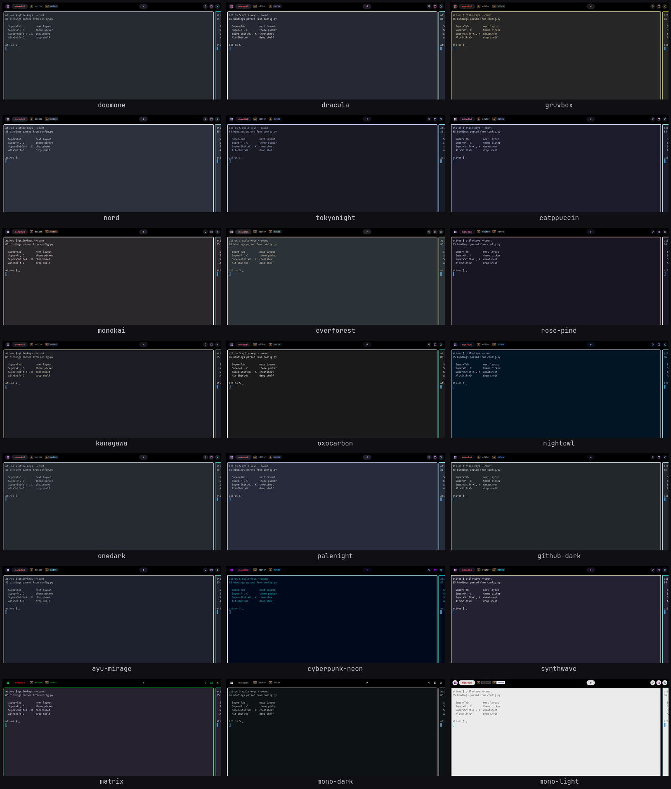

<div align="center">

# Qtile Dotfiles — Arch Linux · X11

**One command installs the whole desktop.** 22 themes that retint every app at once,
a drop-stash, a package picker, and a restart that doesn't flash.


<sub>Tiling · launcher · qdrop · qupdate · a theme switch carried by the restart veil.</sub>

</div>

---

## Install

Fresh Arch base install, no desktop environment, no display manager:

```bash
git clone https://github.com/Mohamedattiadev/Newdotfile-.git ~/.dotfiles \
  && cd ~/.dotfiles/installScripts \
  && ./install.sh
```

Then `startx`. That's it — 41 modules run end to end, and you land on a
complete desktop: qtile, all 22 themes, every font, every widget.

### Optional extras — you do not need these

The command above deliberately leaves out packages that have nothing to do
with the desktop. **Skipping them changes nothing about qtile, the themes,
the fonts or the widgets** — they are tools for work you may simply not do
on this machine. Run this whenever you actually want them, days later is
fine:

```bash
~/.dotfiles/installScripts/wizard.sh --yes --only=dcli-sync-extra
```

| | |
|---|---|
| **Containers** | `docker` · `docker-buildx` · `docker-compose` |
| **Dev extras** | `github-cli` · `git-lfs` · `clang` · `jdk17-openjdk` · `uv` · `ruff` |
| **Virtualisation** | `qemu-desktop` · `edk2-ovmf` — only `vm-test.sh` needs these |
| **Printing** | `cups` · `cups-pk-helper` · `system-config-printer` |
| **Diagnostics** | `xorg-server-xephyr` (test a qtile config in a nested X) · `mesa-utils` (`glxinfo`, for picom trouble on unfamiliar graphics) |

The list lives in
[`.config/arch-config/modules/optional.yaml`](.config/arch-config/modules/optional.yaml)
— add to it and the command above picks the addition up. It is re-runnable:
already-installed packages are skipped, not reinstalled.

> Want to pick modules or preview first? See [Install options](#install-options).
> Something broken? [TROUBLESHOOTING.md](TROUBLESHOOTING.md) logs real cases
> with symptom → root cause → fix.

One manual follow-up the installer doesn't do: tmux's plugins (TPM) need a
one-time bootstrap —
```bash
git clone https://github.com/tmux-plugins/tpm ~/.tmux/plugins/tpm
~/.tmux/plugins/tpm/bin/install_plugins
```
Without it, `vim-tmux-navigator`'s pane navigation and
resurrect/continuum's save-on-interval + restore-on-start all silently
do nothing. See [TROUBLESHOOTING.md → Tmux](TROUBLESHOOTING.md#tmux).

---

## What you get

### One theme, everywhere

Pick a theme and *everything* follows — bar, terminal, rofi, notifications,
GTK, Qt, browser, nvim, even your folder icons.



<sub>10 of the 22 modes. Also: monokai, kanagawa, oxocarbon, onedark, palenight,
nightowl, github-dark, ayu-mirage, cyberpunk-neon, synthwave, mono-dark, and
`wal` (palette derived from your wallpaper).</sub>

```bash
theme-apply gruvbox   # any preset
theme-apply wal       # follow the current wallpaper
theme-toggle          # picker — or Mod+P then c
```


→ [How theming works](#theming)

---

### qdrop — drop things here, use them later

Drag files, text, URLs or images in. Drag them back out into any app.
`Alt+Shift+D` to toggle — or just **shake the mouse while dragging a file** and
it comes to you.


→ [qdrop details](#qdrop)

---

### qupdate — updates and installs, no terminal

Click the updates chip in the bar. Tab one lists pending pacman + AUR packages
with checkboxes. Tab two searches the repos and the AUR.


→ [qupdate details](#qupdate)

---

### A restart you don't see

`Mod+Shift+R` reloads qtile. Normally you'd watch every window from every
workspace flash across the screen for ~2 seconds. Instead a veil frosts the
desktop, shows a card per window, and reports real progress from the incoming
qtile.


→ [How the veil works](#the-restart-veil)

---

### Modes

Every mode is a `KeyChord` that takes over the keyboard and announces itself as a
chip in the bar, listing the keys it accepts. `Esc` leaves.

**`Mod+Space` — language switcher**


**`Mod+P` — rofi mode** (launchers, `c` theme picker, `w` wallpaper picker,
`n` WiFi, `b` Bluetooth)


**`Mod+P` then `w` — wallpaper picker**


**`Mod+P` then `n` — WiFi**, `b` — **Bluetooth**

Two keyboard-driven pickers over `nmcli` and `bluetoothctl`. `j`/`k` to
move, `Enter` connects, `d` disconnects, `x` forgets or removes, `t`
toggles the radio, `/` searches, `r` rescans, `c` aborts an action that is
hanging. WiFi adds `n` for a hidden network and `s` to hand the selected
saved network to a phone as a QR code. A wrong password re-asks instead of
leaving a saved profile that can never connect.

Neither one opens `nm-connection-editor` or the blueman window — the
applets stay in the tray as icons only.

**`Mod+R` — resize mode**


**`Mod+Shift+W` — draw mode** (gromit-mpx overlay)


**`Mod+Shift+K` — cheatsheets** (`k` qtile, `v` vim, `f` fish+kitty)


Every binding on a card, the key hard against the card's right edge, in the
same monospace face the rest of the popups use. The sheets **scroll** rather
than page: **`j`/`k`** move a few rows, **`Tab`**/`Shift+Tab` a screenful,
`Esc` closes, and the header shows how far down you are. Modifier names are
symbols (`⇧` Shift, `⌃` Ctrl, `⏎` Enter, `␣` Space); the header carries the
legend.

Scrolling is also why the sheets are an ordinary popup size rather than
nearly full-screen. Paging tied *capacity* to *size* — the only way to show
more bindings was to be bigger, and they had grown to 1330×750 on a 1366×768
screen, covering the very window you opened them to ask about. With a
viewport that moves, the size only decides how much you see at once.

`k` does double duty: it opens the qtile sheet when none is up, and scrolls
up when one is. Only one sheet is ever open at a time — `v`/`f` close
whichever is showing before opening theirs, which is what makes "the open
one" unambiguous for `j`/`k`/`Tab`.

<sub>Clips are cropped to the bar's right section — that's where the mode chip
appears. Also available: `Mod+/` media, `Alt+F` mouse mode, `Mod+F12`
passthrough.</sub>

---

### The logo, and finding out what any of this does

**Left-click the logo in the bar.** A desktop with 90 documented
keybindings, 22 themes and a dozen custom tools has a discovery problem,
not a terminal-launching problem — so the most prominent click in the bar
answers *"what can this thing do"*.

| | |
|---|---|
| **Left** | documentation menu |
| **Middle** | terminal *(where left-click used to go; `Mod+Return` also still works)* |
| **Right** | `rofi -show drun` |

Seven sections, and **every one is generated from the live system** — a
hand-written menu drifts the moment anything is added, and silently:

| Section | What it lists | Where it comes from |
|---|---|---|
| **Keybindings** | 79 shortcuts, searchable | `config.py`, parsed by `qtile-keys` via Python's AST |
| **Cheatsheets** | qtile · vim · fish popups | qtile IPC, not replayed keystrokes |
| **Documentation** | README · troubleshooting · packages · boot · the config | rendered read-only; the config opens writable |
| **Espanso** | which snippet variables are set, and which are not | `match/*.yml` vs `/etc/environment` |
| **Appearance** | theme · UI scale · wallpaper · splash | the existing pickers |
| **System** | about · package audit · failed services · display + GPU | run live at open time |
| **Maintenance** | merges · orphans · boot errors · package cache | `pacdiff`, `pacman -Qtdq`, `journalctl`, `paccache` |

**Esc goes up, not out.** Every submenu returns to its parent; only Esc at
the top level closes the menu. A menu you have to reopen from the bar after
every glance is a menu you stop using.

**One frame, every section.** All of them draw at 614×432 — the same shape
`dtos-center.rasi` gives every other rofi on this system (`rofi_light`,
`dm-satty`, the drun launcher), applied inside `pick()` so a new section
cannot forget it. They used to inherit the launcher's theme *loosely* and
re-shape on every navigation, which is worse than being the wrong size: a
menu whose frame moves under you is one you stop reading.

That frame fixes a **52-column budget** and every row builder is cut to fit
it — measured from what rendered, not derived, because the arithmetic says
56 and 56 visibly clipped.

**Keybindings** uses the AST rather than a regex because bindings nest
several `KeyChord` levels deep — a regex pass found 44 of 79 and lost every
chord prefix. Mode keys read `Super+P , C`, not a bare `C`.

**Cheatsheets** go through qtile's IPC (`open_cheatsheet()` in `config.py`),
not xdotool. Replaying the chord could not work: entering `Super+Shift+K`
auto-shows the qtile sheet, so the replayed `k` *toggled it back off* and it
appeared for a single frame — and `v`/`f` showed the qtile sheet first, then
replaced it.

**Documentation is rendered and read-only.** Markdown opens through `glow`,
so you read the document rather than its markup, and cannot edit the repo's
own docs by accident. The qtile config is the single writable entry.
Troubleshooting jumps open in `nvim -R` — readonly *mode*, not
`set nomodifiable`, which blocks plugins that legitimately write to their
own buffers and made fidget.nvim throw on every notification.

**Troubleshooting** shows each entry's `**Symptom:**` line *instead of* its
heading — the heading is dropped from entry rows entirely. "Rofi" tells you
nothing; *"yellow wallpaper but rofi selection shows blue/purple"* is what
you would actually type when it happens. Section rows (`##`) keep their
heading, since they have no symptom of their own and a bare "(section)" is
not a landmark you can scroll by. All 126 entries, jumping to the line.

It was a two-column heading + symptom layout at 147 columns — wider than the
screen itself. Two columns do not survive the cut to 52: at ~24 each, both
halves are shredded and neither is readable. One column, and it is the one
you search by.

**Maintenance** is the only section that is not documentation, and the only
one that *acts*. It replaced a Commands section that listed all 38 tools in
`AtiScriptsV1` with their header comments and deliberately never ran any of
them — correct, and a reading exercise nobody opened twice, when the scripts
are all on `$PATH` anyway.

What nothing surfaced was the slow rot: `.pacnew` files never merged,
orphaned dependencies, units that failed while you were looking at a splash
screen, a package cache growing without bound. So that is what is here, with
a live count on every entry — `pacdiff -o`, `pacman -Qtdq`, `journalctl -p 3
-b`, `paccache -d` — and selecting one merges, removes, prunes or upgrades.

Two deliberate omissions. Pending updates come from the **bar's** cache
(`~/.cache/qupdate.json`), never from `checkupdates`, which syncs a private
copy of the package databases over the network and would turn a menu draw
into a multi-second stall — or a hang with no connection. And the orphan
entry opens the **list**, not a bare confirm: *"remove 21 packages?"* with no
names is a prompt you either rubber-stamp or cancel, and neither is a
decision.

Everything opens in a **centred floating window** (`kitty --class
docs-view`, matched by `float_rules`, centred by `_float_and_center_docs`)
at 78% × 80% of the screen, so reading a doc never disturbs the layout.

```bash
rofi_docs               # the menu
rofi_docs keys          # jump straight to a section
qtile-keys              # the binding list on stdout
```

#### Espanso snippets

The snippets in `match/base.yml` hold no personal data — they shell out to
`source /etc/environment; echo "$MY_NAME"`. That is the right design, and it
has a sharp edge: on a machine where those variables are unset, every one of
them expands to an **empty string**, with no error. This section lists which
of the 26 variables are set and which are missing, scaffolds the missing
keys into `/etc/environment` (commented, ready to fill), and opens it with
`sudoedit`.

---

### Boot splash *(opt-in)*

Arch boots with the kernel log on screen — a wall of scrolling text ending
in a mirror list. Worse than ugly: a boot with no feedback is
indistinguishable from a boot that has hung.

`boot-splash` replaces it with the **Arch mark inside a progress ring**,
and **your username as ANSI Shadow block art** underneath, in the colours
of whatever theme is currently active. The name is generated, never
hardcoded: user `ati` gets `ATI`, user `beko` gets `BEKO`.

The logo is not decoration sitting next to a spinner — it lives *inside*
the progress indicator, so the one element that moves is also the one
reporting state. It is read from the distro's own
`/usr/share/pixmaps/archlinux-logo.svg` rather than vendored, recoloured
through its alpha as a stencil, with the trademark glyph dropped by a
connected-components pass (it is a few pixels of grit at this size, and
cropping cannot reach it without cutting the logo's feet).

The block art comes from a vendored glyph table
([`plymouth/ansi-shadow.txt`](.config/arch-config/plymouth/ansi-shadow.txt)),
not from `figlet` — figlet is not installed here, and the ANSI Shadow face
is a *contributed* font that does not ship with it, so using it would mean
both a new package dependency and vendoring a font file of uncertain
licence. The table is 40 glyphs of plain text, and it reproduces the
wizard's own hardcoded `ATI` logo character for character.

It is rendered **solid**. The face draws the letterform with `█▀▄` and its
drop shadow with box-drawing characters, and a single `magick label:` pass
can only fill both in one colour — which produces a hollow double outline
trailing every letter that reads as a cheap 3D bevel. Only the block
characters are kept. `-kerning -1` closes the seam the mono advance leaves
down the middle of each letter: invisible in a mock-up, obvious in cream on
dark.

**It is animated.** Two things move, so a slow boot never looks like a hung
one:

- a **comet sweeps continuously around the ring** — this is the liveness
  signal, and it keeps moving even when plymouth reports no progress at
  all, which is most of a fast boot
- the ring **fills clockwise** with real progress when it is reported

The name breathes on opacity, barely (a 0.06 swing). There is no fade-in:
see *One continuous image* below.

The background is flat and there is no glow. The accent colour has exactly
one job on this screen — the progress arc — so the name is drawn in the
foreground colour; a composition where the largest element and the status
indicator are the same colour has nothing to direct the eye with.

**Proportions.** A three-letter name sits at ~23% of screen width; longer
names scale themselves down so the art never runs past a comfortable share
of the screen. The ring is **26% of screen height**, sized from the screen
rather than fixed: an earlier 96px ring was ~7% of a 1366px panel and,
photographed off the real display, read as a stray dot — the comet was
moving, but there was not enough arc for the motion to be legible. The ring
and the name are laid out as **one group**, then centred and lifted;
positioning each from the screen edges independently is what produced the
old top-heavy stack with a lonely dot under it.

#### One continuous image

The splash used to be bookended by the Arch Linux logo — it appeared for
~3s before, and again for ~4s after, on both sides of the five seconds of
actual splash.

Neither was plymouth's doing. Arch's `linux.preset` ships
`--splash /usr/share/systemd/bootctl/splash-arch.bmp`, which bakes that
bitmap into the UKI as a PE `.splash` section. systemd-boot paints it the
moment a boot entry is picked; plymouth draws over it; and when plymouth
quits, its buffer is released and the bitmap shows through again until
getty clears the console.

So `generate` also renders a **static BMP of the same composition** at the
firmware's framebuffer resolution, and `enable`/`sync` point every
UKI-building preset at it instead. One picture from the boot menu to the
login prompt.

That is also why there is no fade-in: plymouth takes the framebuffer the
instant it starts, so fading up from zero would make the picture *already
on screen* vanish and then reappear. The first plymouth frame is rendered
to match the bitmap exactly — down to the name's opacity, which is 0.94 at
tick 0 because that is where the breathing sine starts.

The presets are pacman-owned, so this is an in-place edit with a backup. A
`linux` package upgrade restores Arch's line; `boot-splash status` reports
it and `sync` puts it back.

```bash
BOOT_SPLASH_SIZE=32 boot-splash generate   # bigger, if you want it
```

The ring ships as pre-rendered frames (48 for the comet, 41 for the fill,
~400 KB). Plymouth's script language cannot draw an arc, and rotating an
image every frame at 50 fps during early boot is the kind of per-frame work
that makes a splash stutter on slow hardware.

**It follows your theme.** `theme-apply` re-renders it on every switch. But
the theme is *embedded in the initramfs* (plymouth runs before `/` is
mounted), so the boot screen only changes once `mkinitcpio` reruns — about a
minute, far too slow for a colour change. So `theme-apply` regenerates and
then tells you the boot screen is out of date; `boot-splash sync` does the
rebuild when you want it. `boot-splash status` shows both states.

```bash
boot-splash generate       # render + install the theme (touches nothing about boot)
boot-splash preview        # see exactly what will appear, at your resolution
boot-splash preview --real # run plymouth for real on a spare VT
boot-splash check          # 16 pre-reboot safety checks
boot-splash sync           # rebuild the initramfs to match the current theme
boot-splash enable         # wire into initramfs + kernel cmdline
boot-splash disable        # reverse all of it
boot-splash status         # what is installed, hooked and set
```

`preview` renders an **animated GIF** from the real installed assets at your
actual screen resolution, using the same arithmetic the plymouth script
uses — so the timing and layout you see are the ones it will produce. Running `plymouthd` from a
desktop session shows nothing at all, because plymouth draws to the DRM
console and X owns the display; that looks like a broken theme when it is
fine, so `preview` does the honest thing instead.

It is **opt-in and not part of a default install**, because `enable` edits
`/etc/mkinitcpio.conf` and the kernel cmdline and rebuilds the initramfs —
a different category of risk from every other module here.

Two safety properties worth knowing:

- **The LTS rescue entries stay verbose.** `boot-fallback` strips
  `quiet`/`splash` from their options. A rescue entry that inherited the
  splash would show a logo while hiding the kernel messages saying what
  broke — indistinguishable from the failed boot you are escaping.
- **`enable` refuses unless `check` passes.** Sixteen checks run first —
  plymouth installed, colour placeholders substituted, theme script braces
  balanced, plymouth recognises the theme, the static boot frame is
  *uncompressed 24-bit BMP3* (systemd-boot reads nothing else and silently
  draws blank for anything else, which looks exactly like a broken theme),
  the UKI presets point at it, a verbose LTS entry exists and is not
  splashed, the LTS kernel is on the ESP. A failure changes nothing.
- **Every file edited is backed up** (`*.bak-boot-splash`) — mkinitcpio.conf,
  the kernel cmdline, and each UKI preset — and `disable` restores them all
  and rebuilds.

```bash
./wizard.sh --yes --only=boot-splash    # install plymouth + enable
./wizard.sh --uninstall --only=boot-splash
```

---

## Videos

**System overview** — the GIF at the top of this page is a 33s cut of it.

<!-- Full 1:46 tour, recorded 2026-07-28: ~/Videos/qtile-overview.mp4
     Drag that file into any GitHub issue/PR comment box, then paste the
     https://github.com/user-attachments/assets/... URL it returns on the
     line below (a bare URL on its own line renders as a player).
     The two older overview clips it replaces are in git history at 0e1ed51. -->

**Features**

https://github.com/user-attachments/assets/6990186e-336d-48d4-8330-7c8ffd0f0a81

https://github.com/user-attachments/assets/fec68105-483d-4e7f-9573-6f43291c2d39

https://github.com/user-attachments/assets/acb09f1a-f268-4a68-ae23-819ecee27453

https://github.com/user-attachments/assets/9d8f53bb-eead-4e02-a844-3aba44fe9a34

https://github.com/user-attachments/assets/0189c230-a0df-4d8f-9687-ca8e5c00ed4a

---

## Everyday commands

| | |
|---|---|
| `startx` / `letsgo` | start the session from a TTY |
| `Mod+Shift+R` | restart qtile (keeps layout + window→group state) |
| `dcli sync` | update the system, snapshot first |
| `theme-apply <name>` | switch theme |
| `Mod+P` → `c` | theme picker |
| `Alt+Shift+D` | toggle qdrop |
| `fc-cache -fv` | reload fonts |

Reload config without a restart: `qtile cmd-obj -o cmd -f reload_config`

`letsgo` is a **fish function**, not an alias — it only exists in fish. The login
shell is set to fish (wizard step `login-shell`) so the TTY matches what kitty
already forces. Without it the TTY drops to bash and `letsgo` is
`command not found` — exactly when you need it, after X has died. Revert with
`chsh -s /usr/bin/bash $USER`.

---

## Requirements

1. **Arch Linux**, clean base install
2. **X11 only** — Wayland is not supported
3. **No display manager** — TTY + `startx`
4. Packages managed declaratively via [dcli](https://gitlab.com/theblackdon/dcli)

Systems that don't match may need manual intervention.

### Any screen size

Every pixel value in the qtile config was tuned on a 1366×768 14" panel.
Copied unchanged to a 15" 4K laptop, that is a sliver of a bar with
unreadable text — the one thing these dotfiles cannot keep identical by
copying files, because the right answer depends on the glass.

`ui-scale` computes a factor from the primary display's real DPI and
writes it to `~/.cache/qtile/ui_scale` (per-machine, untracked). qtile
multiplies every font size, bar height, icon and margin by it; `Xft.dpi`
carries the same factor into GTK, Qt, rofi and dunst. It runs from
`.xinitrc` on every login, so docking to an external monitor re-scales.

| Screen | DPI | scale |
|---|---|---|
| 14" 1366×768 *(reference)* | 125 | 1.00 |
| 24" 1080p | 92 | 1.00 |
| 27" 1440p | 109 | 1.00 |
| 15" 1080p | 142 | 1.15 |
| 14" 1080p | 158 | 1.25 |
| 13" 1440p | 227 | 1.80 |
| 15" 4K | 284 | 2.25 |

Physical size, not resolution: a 24" 1080p monitor sits further away and
has larger pixels, so it correctly stays at 1.00 rather than shrinking.
The factor never goes below the reference — that panel is already small.

Disagree with the result? It is two clicks, not a config edit:

```bash
ui-scale-toggle        # rofi picker  (also: docs menu → UI scale)
ui-scale --set 1.25    # pin a value; survives re-detection
ui-scale --auto        # back to detection
ui-scale --show        # detected vs pinned vs active
```

### Any x86_64 machine — Intel, AMD or NVIDIA

Nothing about the GPU is hardcoded. The `gpu` module reads the display
controller's PCI vendor id and installs the matching driver set
(`graphics-intel.yaml` / `-amd.yaml` / `-nvidia.yaml`), then reads
`/proc/cpuinfo` and installs `intel-ucode` or `amd-ucode` to match. A
laptop with switchable graphics gets both sets; a VM gets neither, because
mesa's generic KMS driver is already correct there.

This matters more than it sounds. `picom.conf` asks for `backend = "glx"`
with `vsync = true`, so a machine with no driver for its actual GPU falls
back to llvmpipe software rendering — the animations, rounded corners and
shadows the desktop is built around either crawl or vanish, with nothing in
the logs pointing at a package list. NVIDIA additionally gets
`--no-use-damage` written to a per-machine `picom/gpu.env`, because its
proprietary GLX is the one stack where that optimisation smears during
animations. The result is that the motion looks the same on all three.

**ARM (aarch64) is not supported.** The `gpu` module detects a non-x86_64
architecture, warns, and skips PCI and microcode detection rather than
installing something wrong — but the AUR packages this repo depends on
(`picom-ftlabs-git`, `qtile-extras`, `brave-bin`, `google-chrome`) are not
all built for ARM, so a full install will not complete.

> Based on [Distrotube's](https://www.youtube.com/c/DistroTube/videos) Qtile
> configuration, extended with my own customization and workflow. It follows the
> general structure and philosophy of the original; the final implementation
> reflects my own use case.

---

# Reference

<a name="install-options"></a>
<details>
<summary><b>Install options</b> — pick modules, dry run, uninstall</summary>

<br>

```bash
./wizard.sh                 # interactive: TUI checkbox picker
./wizard.sh --dry-run       # preview every command, touch nothing
./wizard.sh --yes           # same as ./install.sh
./wizard.sh --only=stow,themes,browser-flags   # subset
./wizard.sh --skip=whisper,whisper-fast,piper               # skip heavy downloads
./wizard.sh --yes --only=dcli-sync-extra    # opt-in extras (docker, jdk, qemu, printing)
./wizard.sh --audit         # package drift check (read-only, no sudo)
./wizard.sh --uninstall     # reverse wizard writes (safe: never
                            #   touches packages or downloaded models)
./wizard.sh --uninstall --dry-run  # preview reversals
```

`--only`/`--skip` need the `=`. `--only foo` is **rejected**, not quietly
ignored — because an ignored filter means the full live install runs instead,
and its second module is `pacman -Syu`. Unknown flags and unknown module ids
fail the same way: exit 2, nothing touched.

Every one of the 41 modules has a reversal, even where that reversal is a
deliberate no-op (`dcli-sync`, `piper`, `whisper`, `whisper-fast`,
`wallpapers` — removing those would delete packages, multi-hundred-MB
downloads, or a ~13x-faster build the uninstaller has no business
touching). The wizard refuses to start if a module is ever added
without one, because the alternative is discovering it *part-way through* an
uninstall, with earlier modules already reversed.

**What `./install.sh` does**

- Auto-bootstraps `gum` via pacman (~2 s)
- Runs all 41 modules end-to-end
- Keeps `sudo` alive for the whole run (primed once, refreshed in the
  background) so long AUR builds don't silently drop package installs when the
  credential cache would otherwise expire mid-run
- Any failed module auto-skips, logs to `/tmp/wizard-<id>.err`, and is listed in
  the final summary. `dcli sync` additionally self-verifies with a dry-run and
  retries if anything is still missing

The wizard renders an ASCII banner, grouped module cards (System / Dotfiles /
Themes / Browsers / Apps / Media), spinners, progress bars and colored badges.
On failure it shows a red-bordered error tail and prompts **retry · skip ·
quit** (unless `--yes`, which auto-skips).

**The 41 default modules**

| # | id | What |
| - | -- | ---- |
| 1 | `sanity` | Sanity checks (Arch, X11, dotfiles present) |
| 2 | `bootstrap` | Bootstrap pkgs (git, stow, xorg-server, base-devel) |
| 3 | `yay` | Build `yay-bin` from AUR if absent |
| 4 | `dcli` | Install `dcli-arch-git` |
| 5 | `stow` | Stow dotfiles into `$HOME` |
| 6 | `arch-config` | Sync `arch-config` host file to current username |
| 7 | `dcli-sync` | **`dcli sync --force`** — installs every declared pkg (self-verifies + retries) |
| 8 | `cargo` | Cargo tools (`rustup default stable` + `pomodoro-tui`) |
| 9 | `ati-scripts` | Install AtiScriptsV1 to `/usr/local/bin` |
| 10 | `simplenote` | Two-way sync between the `Mod+Shift+S` TODOS note and the Simplenote phone app — pushes on every write, pulls when the window opens, parks a `.remote-*` copy rather than guessing a winner when both sides changed. Asks for the account login at the end of the run |
| 11 | `pacman-guard` | PreTransaction hook: refuse any pacman/yay/dcli upgrade when `/` is too full |
| 12 | `boot-fallback` | systemd-boot entries for `linux-lts` + a full-module rescue initramfs |
| 13 | `login-shell` | `chsh` to fish so the TTY matches kitty |
| 14 | `touchpad` | Touchpad config (`/etc/X11/xorg.conf.d/30-touchpad.conf`) |
| 15 | `xinit` | Write `~/.xinitrc` (qtile · picom · wallpaper · tray applets · copyq server · `QT_QPA_PLATFORMTHEME=qt6ct` · cursor) |
| 16 | `xresources` | Write `~/.Xresources` (Xcursor size 24 + Breeze theme) |
| 17 | `xmodmap` | Write `~/.Xmodmap` — Caps is repurposed as **Alt_L outright**, with no tap-to-Caps-Lock fallback (Alt is dead in hardware on this laptop) |
| 18 | `lid` | Lid close = ignore (`systemd-logind`) |
| 19 | `image-envs` | Suppress VIPS warnings + ensure `~/tmp` (fish `TMPDIR`) |
| 20 | `flatpak` | Legacy cleanup only — qdrop replaced flathub/collector |
| 21 | `piper` | Download Piper voices (EN + DE) |
| 22 | `whisper` | Download Whisper `base.en` (live dictation) + `small.en` (batch) models |
| 23 | `whisper-fast` | Rebuild `whisper-cli`/`whisper-stream` optimized + patched, shadow via `/usr/local` (AUR package is ~13x slower unoptimized, and doesn't build `whisper-stream` at all) |
| 24 | `mic-gain` | Enable `fix-mic-gain.service` — reasserts mic capture gain WirePlumber resets to clipping levels on every login |
| 25 | `passwordless-sudo` | Passwordless sudo |
| 26 | `ownership` | Fix dotfiles ownership |
| 27 | `disable-dm` | Disable all display managers |
| 28 | `candy-icons` | Install candy-icons theme |
| 29 | `wallpapers` | Clone wallpaper collection |
| 30 | `speed` | System speed tweaks (`speed_boost.sh`) — zram sized to RAM + zram-aware `vm.*` sysctls |
| 31 | `themes` | Theme system (pywal + palette precompile + initial doomone apply) |
| 32 | `dark-mode` | Advertise `prefer-dark` via xdg-desktop-portal so sites serve their own dark theme |
| 33 | `browser-flags` | brave/chrome/chromium wal theme extension flags (+ strips legacy force-dark) |
| 34 | `browser-memory` | Memory Saver by policy — discards idle tabs, excludes whatsapp/chatgpt/deepseek |
| 35 | `chrome-policy` | Chrome/chromium theme policy (sign key + enterprise force-install) |
| — | `dcli-sync-extra` | **Opt-in, never in a default run.** docker · jdk · qemu · printing — see [Optional extras](#optional-extras--you-do-not-need-these) |
| — | `boot-splash` | **Opt-in, never in a default run.** plymouth splash with your username + progress bar; edits kernel cmdline + initramfs |

**Run after your first desktop login** — the `simplenote` module needs a
browser, and `install.sh` finishes in a TTY before `startx`. If the wizard
told you to come back to it (it does this automatically when there is no
graphical session yet), log in to the desktop and run:

```bash
cd ~/.dotfiles/installScripts && ./wizard.sh --only=simplenote
```

It asks for your Simplenote email and password, then verifies by pushing the
`Mod+Shift+S` TODOS note for real. On networks that block
`auth.simperium.com` — the login host, which is separate from the reachable
note API — it detects that, copies a one-line snippet to your clipboard for
the browser console, and takes an access token instead.

Once configured, the note syncs **both ways**: every write pushes, and opening
the window pulls anything typed on the phone. Editing offline on either side is
safe — the pull doubles as the retry for an unsent write, and a push checks the
note before overwriting it. Merging is the one thing that is never automatic:
when both sides changed you get a `TODOS.md.remote-<timestamp>` to reconcile by
hand rather than a silent guess. See
[TROUBLESHOOTING.md](TROUBLESHOOTING.md) → **Simplenote** for every case and
what each log line means.

**Optional post-install tuning** — two interactive scripts, not wired into
`install.sh` because they need a reboot, are per-machine, and prompt before
touching anything. Idempotent, back up before writing, print revert
instructions at the end.

```bash
bash ~/.dotfiles/installScripts/grub_boost.sh    # kernel cmdline: nowatchdog, quiet loglevel=3, cursor off, i915 GuC
bash ~/.dotfiles/installScripts/service_trim.sh  # audit + disable heavy services (docker, postgres, tailscaled, ...)
```

**Try it without risking your machine** — `vm-test.sh` runs the whole
thing on a throw-away Arch VM. Its preflight refuses with the specific
number that failed (RAM, disk, KVM, qemu) instead of wedging the host
halfway through a 500 MB download:

```bash
bash ~/.dotfiles/installScripts/vm-test.sh --check   # creates nothing
bash ~/.dotfiles/installScripts/vm-test.sh --smoke   # 2-min headless boot check
bash ~/.dotfiles/installScripts/vm-test.sh           # fetch ISO, boot
```

**The 3-minute version** — `container-test.sh` runs the config-only modules
on a throw-away Arch container. It cannot test X11, systemd, the GPU or
theme rendering, so it does not replace `vm-test.sh`. What it does catch,
fast enough to run on every change:

- a config path that only resolved because `$HOME` happened to be `/home/ati`
  (it installs as a user called `tester` and greps the deployed result)
- a `@HOME@` template that never got rendered
- a step that is not idempotent — it runs the wizard twice and diffs
- a module yaml that no longer parses

It populates the container from `git ls-files`, not from the directory and
not from a clone: that is exactly what a fresh clone receives, so anything
gitignored is correctly absent, and staged work is tested before it is
committed.

```bash
bash ~/.dotfiles/installScripts/container-test.sh --check  # verify runtime
bash ~/.dotfiles/installScripts/container-test.sh          # full run
bash ~/.dotfiles/installScripts/container-test.sh --keep   # leave it to poke at
```

**The 5-second version** — `validate.sh` needs no container and no root:

```bash
bash ~/.dotfiles/installScripts/validate.sh
```

It parses every tracked shell, Python, fish and YAML file, **loads the
qtile config for real** (qtile falls back to its stock config on an error,
so the failure mode is a desktop that looks like a stranger's rather than
an error anyone sees), greps for hardcoded home paths, checks every
`.tmpl` has a renderer, and runs a full wizard dry-run.

The `githooks` module symlinks a pre-commit hook that runs `validate.sh`
plus `--audit` — the two fast layers only, because a hook that takes three
minutes gets `--no-verify`'d within a week.

**The four layers, cheapest first.** Each catches what the one above cannot:

| | time | catches |
|---|---|---|
| `validate.sh` | seconds | syntax, qtile config load, hardcoded paths, unrendered templates |
| `wizard.sh --audit` | seconds | declared packages vs installed, both directions |
| `container-test.sh` | ~3 min | a real install as a user who is **not** you; idempotency |
| `vm-test.sh` | ~40 min | X11, systemd, GPU, boot — the parts nothing else can reach |

</details>

<a name="packages"></a>
<details>
<summary><b>Packages (dcli)</b> — declarative package management</summary>

<br>

Every pacman/AUR package is declared in YAML under
`~/.dotfiles/.config/arch-config/`:

```
arch-config/
├── config.yaml                 # pointer to active host
├── hosts/ati.yaml              # enabled_modules + host packages
└── modules/
    ├── base.yaml               # dcli itself, timeshift, pacman-contrib
    ├── apps.yaml               # daily apps (brave, obsidian, ...)
    ├── wm.yaml                 # qtile, qtile-extras, picom, qt5ct/qt6ct, ...
    ├── dev.yaml                # nvim, git, fish, cargo/rust, ...
    ├── media.yaml              # pipewire stack, easyeffects, ...
    ├── fonts.yaml              # Nerd Fonts, Amiri, Cairo, ...
    ├── system-tools.yaml       # xcape, evtest, dmenu, poppler, ...
    ├── graphics.yaml           # Intel HD 520 (mesa, vulkan-intel, ...)
    ├── network.yaml            # iwd, bluez
    ├── xorg.yaml               # xinit, xinput, xev, xwallpaper
    └── python-lib.yaml         # psutil, dbus-fast, pillow, ...
```

Change a module → `dcli sync` → the system converges. `timeshift-autosnap`
snapshots on every sync, so a broken update is a one-command rollback.

To add or remove a package, edit the right `modules/*.yaml`, run `dcli sync`,
then commit when the machine is verified working:

```bash
cd ~/.dotfiles
git add .config/arch-config
git commit -m "arch-config: <change>"
git push
```

Upstream: https://gitlab.com/theblackdon/dcli

</details>

<a name="theming"></a>
<details>
<summary><b>Theming</b> — how one command retints 15 different consumers</summary>

<br>

**22 modes.** Presets: `doomone` · `dracula` · `gruvbox` · `nord` · `tokyonight`
· `catppuccin` · `monokai` · `everforest` · `rose-pine` · `kanagawa` ·
`oxocarbon` · `onedark` · `palenight` · `nightowl` · `github-dark` ·
`ayu-mirage` · `cyberpunk-neon` · `synthwave` · `matrix` · `mono-dark` ·
`mono-light`. Plus `wal` = pywal palette from the current wallpaper.

- **Picker**: `Mod + P` then `c`. Friendly names (`wal` shows as `Wallpaper`),
  current theme marked with `●`.
- **Light mode**: `mono-light` flips the base GTK theme to `Breeze` +
  `Papirus-Light` (dark themes stay on `Sweet-Dark` + `Papirus-Dark`) so
  gtk apps render properly light-on-white. The file manager
  (`pcmanfm-qt`) is Qt, so it follows the generated `qt6ct`/`qt5ct`
  palette instead — same colors, different path.
- **Instant preemption**: rapid picker clicks kill the in-flight `theme-apply`
  and start the newer one — no silent lock skips.
- **Concurrency**: `theme-apply` holds `flock` on
  `~/.cache/qtile/.theme-apply.lock`; keybind spam is dropped rather than
  corrupting caches.

**What reloads, and how**

| Consumer | Reload mechanism |
|---|---|
| kitty | `set-colors --all` per live socket + SIGUSR1 |
| rofi | symlink `current-palette.rasi` swap |
| dunst | render `dunstrc.tmpl` + restart |
| qtile | `restart` (detached so the caller doesn't deadlock) |
| gtk 3/4 | `@import` overlay at `~/.cache/qtile/gtk-wal.css` |
| qt5 / qt6 (telegram, …) | `gen_qt_colors()` writes a 21-role QPalette to `~/.config/qt6ct/colors/current.conf` (+ qt5ct). Needs `QT_QPA_PLATFORMTHEME=qt6ct`, exported from `.xinitrc` — Qt ignores the GTK theme entirely and falls back to a **light** palette without it. Read at app start, so a fresh X session is required |
| qutebrowser | homepage: inline `<style>` + `--accent` CSS var. Browser chrome (tabs/statusbar/completion/messages/prompts/downloads, 78 options): `config.py:_apply_palette()` reads `current_palette.json` — runs for **all** modes, not just `wal`. Both via `:config-source` + `:restart` |
| nvim | fs_event on `~/.cache/qtile/theme_mode` + `current_palette.json` re-sources the scheme; aliased modes (matrix, mono-*, synthwave, cyberpunk-neon, palenight, github-dark, ayu-mirage, onedark, nightowl) render distinct highlights from the JSON when no dedicated plugin is installed (Snacks dashboard uses dominant hue) |
| brave | `--load-extension` reads live `manifest.json` on relaunch (id matches via embedded `key`) |
| chrome / chromium | Enterprise policy `force_installed` from local `updates.xml`; `.crx` repacked + Preferences purged each apply so install lands immediately. Extension id is derived from `browser-theme.pem` at runtime (never hardcoded — it is per-machine), and browsers relaunch via their `/usr/bin` wrapper so `*-flags.conf` (`--load-extension`) is actually applied |
| papirus folders | `papirus-folders -C <hue-match> -u` (needs the `papirus-folders` AUR pkg — declared in `system-tools.yaml`; silently no-ops if missing) |
| eww widgets | daemon killed + `setsid eww daemon` restart + reopen prior windows (plain `eww reload` left compiled scss cached) |
| qtile popups + WallpaperPicker | `popups/_wal_colors.load_colors()` reads `current_palette.json` first, falls back to `~/.cache/wal/colors.json`; muted tone derived from a `bg`→`fg` blend for readable dividers |
| gtk base + icon theme | `settings.ini` rewritten per palette: `mono-light` → `Breeze` + `Papirus-Light`; all others → `Sweet-Dark` + `Papirus-Dark` |
| cursor | `~/.Xresources` sets `Xcursor.size: 24` + `Xcursor.theme: breeze_cursors`; loaded via `xrdb -merge` in `~/.xinitrc` |
| **web page content** | Not themed by this repo, on purpose. The `dark-mode` module sets `org.gnome.desktop.interface color-scheme=prefer-dark`, which xdg-desktop-portal republishes as `org.freedesktop.appearance color-scheme = 1`. Chromium reads that key and reports `prefers-color-scheme: dark`, so each site serves **its own** dark stylesheet. The browser *chrome* stays palette-driven via the extension rows above |

> **Why page content is not force-darkened.** `--enable-features=WebContentsForceDark`
> used to sit in all three `*-flags.conf`. It is a per-pixel colour transform
> applied after render, with no knowledge of the page's design — fine on a site
> with no dark theme, destructive on one that has a good one (it re-darkens an
> already-dark palette and blows out gradients and accent text). The portal
> preference above replaces it. For the occasional site with no dark theme,
> enable force-dark for that site from the page menu instead of globally.
>
> ```bash
> # confirm the desktop is advertising dark  ->  v u 1
> busctl --user call org.freedesktop.portal.Desktop /org/freedesktop/portal/desktop \
>   org.freedesktop.portal.Settings ReadOne ss org.freedesktop.appearance color-scheme
> ```

**Wallpaper mode (`wal`)** uses a precompiled cache. `wal-precompile` walks
`~/Pictures/Wallpapers/` and produces per-image palettes at
`~/.cache/qtile/palettes/<basename>.json`, each forced to a doomone-quality bar
(WCAG AAA bg/fg, WCAG AA per-accent, guaranteed hue spread). See
`.config/qtile/WAL_PRECOMPILE_REPORT.md`.

Drop any image into `~/Pictures/Wallpapers/` and select it — `theme-apply wal`
auto-runs `wal-precompile --only <basename>` on cache miss. No manual step.

**Palette semantics** — 6-slot hue-concentrated: `color1` urgent (always warm),
`color2` dominant (main wallpaper hue), `color3` warm-fill, `color4` cool-fill,
`color5` complement, `color6` info/cyan. Bar accents pin to `color2`. Test
harness at `.config/qtile/scripts/wal-visual-test.py` validates 12 hue buckets
end to end.

**Wallpaper vs. theme** — changing the wallpaper re-derives the palette **only
when the active mode is already `wal`**, since `wal` is the mode that means
"follow the wallpaper". On a preset you picked a fixed palette on purpose, so a
new wallpaper swaps the desktop image and nothing else. All three setters
(`dm-setbg`, the dmscripts `dm-setbg`, `WallpaperPopup`) check
`~/.cache/qtile/theme_mode` before invoking `theme-apply wal` on a background
thread, and fail closed if that file is unreadable.

**Shared UI font** — the qtile popups use `qtile_extras`' default `sans` family,
so dunst (`Sans 10`) and eww (`$ui-font: sans-serif`) resolve through the same
fontconfig alias rather than naming a family. Restyle all three at once by
editing `~/.config/fontconfig/fonts.conf`; `fc-match sans` shows the winner.

**Rofi UI stack** — all `.rasi` themes import a shared `base.rasi` (doom-one
flavor, radius 12, palette-driven). Overrides are layout-only. Rofi scripts
source `.config/AtiScriptsV1/rofi_common.sh` for palette parsing, wayland-safe
clipboard, dep checks and a compact `rofi_confirm`. Notable: `rofi-kill` shows
PID + process + window title (via `wmctrl -lp` + PPID walk for browser
subprocesses) in aligned columns.

**State files** (auto-created — no manual bootstrap):

- `~/.cache/qtile/theme_mode` — active mode name
- `~/.cache/qtile/current_palette.json` — 9-slot palette dumped on every apply; consumed by nvim + popups
- `~/.cache/qtile/layout_state.json` — MonadTall ratios + relative_sizes per group
- `~/.cache/qtile/window_group_state.json` — wid→group map + per-group focus order
- `~/.cache/wall` — symlink to the active wallpaper

</details>

<a name="the-restart-veil"></a>
<details>
<summary><b>The restart veil</b> — and why a qtile restart used to flash</summary>

<br>

`Mod+Shift+R` (and any theme change) goes through `_smooth_restart`, which
raises a veil over the transition: `qtile/scripts/qtile-restart-veil.py`, a
**separate process** so it survives the `execv`.

It frosts the desktop, shows a card carrying each window's real icon, and
reports genuine progress from the incoming qtile — not a timer. It exists
because qtile's own boot maps every window from every workspace for ~2s before
the `startup` hook fires, which is unfixable from config alone.

The veil pauses dunst and keeps itself topmost by reacting to root-window
restack events, so nothing lands on top of it. Needs `python-gobject`; without
it the reload falls back to a plain restart. Measured time budget:
TROUBLESHOOTING.md → "the restart veil".

**Layout survives the restart.** MonadTall ratios + secondary stack sizes save
every 3s to `layout_state.json`; window→group mapping + per-group focus order
save to `window_group_state.json`. Both restore on `startup_complete` (+0.6s /
+1.6s). Manually-moved windows stay in their chosen group even though Match
rules re-fire on adoption — the `client_new` hook overrides Match assignment for
any wid present in the restored map.

</details>

<a name="qdrop"></a>
<details>
<summary><b>qdrop</b> — native drop-stash</summary>

<br>

Lightweight GTK3 daemon replacing the flatpak `it.mijorus.collector`. Slides in
from top-center, stashes files/text/URLs, drag them back out anywhere. Themed
live from the active palette.

**Usage**

- `Alt+Shift+D` — toggle.
- **Shake** the mouse *while actually dragging a file/folder/image* (any axis —
  left-right, up-down, diagonal; 2 reversals in 1.2s) → auto-shows. A
  click-drag carrying nothing (text selection, rubber band, panning) is ignored;
  shaking while it's already open just keeps it open instead of replaying the
  reveal.
- Drop file/text/URL/image into the window → adds an entry. URL text is
  auto-detected.
- Drag an item back out → paste into any app.
- Rubber-band select on empty area. Ctrl+A / Ctrl+click. Right-click for menu.
- `Ctrl+V` pastes clipboard — text, files, or a **copied image** (a web image is
  raw pixels, saved to `~/.cache/qdrop-images/` and added as a normal file
  entry). `Ctrl+F` search. `Del` remove. `Enter` open.
- Text / text files → floating alacritty+nvim (`clip-view` class).
- Image files → `imv` (uses the existing qtile float rule).
- Auto-hides 8s after the pointer leaves (paused while dialogs/menus are open).

**Files**

- `.config/qtile/scripts/qdrop.py` — daemon + IPC + widget
- `.config/qtile/scripts/qdrop_watch.py` — XInput2 raw-event shake detector.
  Firing also requires a real XDND drag in flight, which is why a plain
  click-drag is ignored. `--debug` logs each decision, `--any-drag` disables the
  drag requirement.
- `.config/qtile/scripts/qdrop_test.py` — pure/live tests: helpers, IPC, shake
  detection, and a stubbed-GTK suite over the open/close state machine (repeat
  SHOW, mid-animation reversals, group switch)
- Autostart entry in `autostart.sh` launches daemon + watcher at login.

**IPC** — Unix socket at `/tmp/qdrop-$UID.sock`:
`qdrop.py --show|--hide|--toggle|--add-text TXT|--reload|--status`. Palette
reload auto-triggers via mtime poll. Persistence at `~/.cache/qdrop.json`.

**Resources** — 0% CPU idle, ~90 MB combined RSS.

</details>

<a name="qupdate"></a>
<details>
<summary><b>qupdate</b> — pending updates + install picker</summary>

<br>

Click the CheckUpdates chip in the top bar. Floating GTK3 daemon, two tabs.

**Updates tab**

- Lists pending pacman + AUR packages (parallel `paru -Qu` + `paru -Qua`).
- Cache-first render (`~/.cache/qupdate.json`) → instant open, revalidation runs
  on a background thread.
- Per-package checkbox + `PKG`/`AUR` badge + `oldver → newver`.
- Refresh / All / None / filter.
- Footer: `Update selected` (`paru -S --needed`) or `Full upgrade` via the tool
  combo — defaults to **`dcli sync`** so timeshift snapshots and arch-config
  module state stay in sync.
- `Run in background` → no terminal, notify-send on success/failure, log at
  `/tmp/qupdate-$UID-run.log`.

**Install tab**

- Searches official repos (`pacman -Ss`) + AUR (`paru -Ssa`) with 350ms debounce.
  Repo search is used for common queries so paru's "too many results" cap
  doesn't apply. Deduped and sorted: exact match → prefix → substring → repo
  before AUR → not-installed first → shortest name.
- Rows show name + badge + description, with an `installed` marker when present.
- `Install selected` runs `paru -S --needed <pkgs>` (terminal or background).

**Shared** — socket at `/tmp/qupdate-$UID.sock`:
`qupdate.py --show|--hide|--toggle|--refresh|--status|--daemon`. Palette-themed
(polls `current_palette.json` mtime every 3s). Autostarted hidden at login;
widget Button1 sends `--toggle`.

</details>

<a name="updating"></a>
<details>
<summary><b>Updating safely</b> — the guard rails and the recovery ladder</summary>

<br>

Use `dcli update` (or `safe-update`), **not** bare `pacman -Syu`. Three layers
guard it:

1. A pacman `PreTransaction` hook that refuses when `/` is too full. It fires
   for *any* tool, so it cannot be bypassed.
2. A dcli `pre_update` hook that blocks on low space, snapshots stored on the
   root device, or an inconsistent package DB.
3. A `post_update` hook that finds AUR packages broken by a library soname bump
   and puts the rebuild command straight on your clipboard.

**Recovery ladder**: `downgrade` → LTS fallback kernel at the boot menu → LTS
*rescue* entry (same kernel, full-module initramfs) → `pacman-static` from the
Arch ISO → Timeshift restore from `/home`.

The wizard module `boot-fallback` writes both LTS boot entries — the `linux-lts`
package on its own ships none, so without it the rescue kernel is installed but
unreachable.

Details: TROUBLESHOOTING.md → "The update safety net".

</details>
